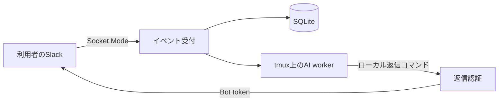

# 配布範囲と構成

## 配布方針

既存の公開版を継続保守し、受取人が自分のSlack AppとAI CLIで動かせる形にします。
2026-09-07の本体・配布版比較とFableによる設計相談では、公開版の基本機能を保って導入手順を整える方針を採用しました。

## 機能範囲

| 範囲 | 配布版 |
| --- | --- |
| Slackのメンション、DM、スレッド継続 | 維持 |
| 添付ファイル、スレッド文脈 | 維持 |
| Claude Code / Codexのworker起動 | 維持。Claudeが既定 |
| 質問検知とSlackからの回答 | 維持 |
| 進捗、待機、完了返信、リアクション | 維持 |
| セッション停止、再開、並行処理 | 維持 |
| SQLite、イベント重複抑止、永続キュー | 維持 |
| `ai-boot`による提案 | 維持 |
| 名前・口調・役割の変更 | `IDENTITY.md`で設定 |
| 請求・会計と専用通知処理 | 含めない |
| 社内の採用・タスク管理連携 | 含めない |
| 社内Keychain、個人パス、社内名簿、運用データ | 含めない |
| ホスト固有の常駐設定 | 含めない。runで起動 |

## 実行の流れ

ワークスペースごとに利用者自身がSlack Appを作成します。Bot tokenとApp tokenはその環境の `.env` に保存し、実行データはコードの外へ保存します。

## 運用上の前提

workerは実行端末のOSユーザー権限で動作します。依頼できる人を信頼できるチームで使用してください。
`members.json` は呼び名とセッション管理者の設定で、起動許可リストではありません。
AI CLI、Slack、実行端末の利用契約やアカウントは配布物に含まれません。

## 更新する場所

このリポジトリが配布版の保守先です。組織固有の機能は配布版へコピーせず、基本機能の修正を必要な範囲で選別して反映します。
テンプレートは `templates/`、起動手順は [導入手順](setup.md)、受取人による確認は [動作確認](smoke-test.md) を参照してください。
